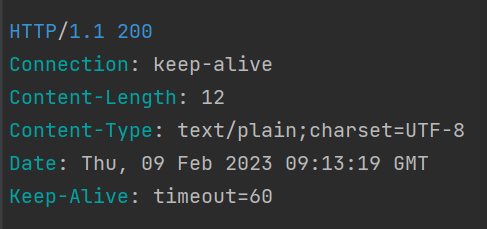
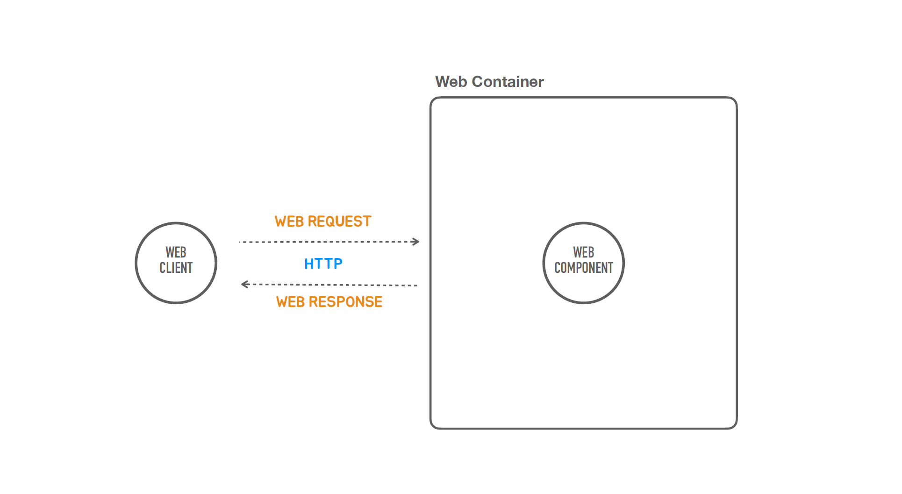

## ✅HTTP

### 💡 웹 Request와 Response의 기본 구조를 이해하고 내용을 확인할 수 있어야 한다

- Request
    - Request Line: Method, Path, HTTP Version 
      🔍요청의 첫줄에는 어떤 메서드를 사용할건지 가장 먼저 등장(GET, POST, DELETE...) 
      🔍다음에 URL에서 경로 부분이 나온다 쿼리스트링으로 파라미터가 전달될 수도 있다. 
      🔍HTTP 버전 정보
    - Headers 
      🔍이 헤더에 있는 정보는 요청에 처리하는 방식이 달라지거나 응답을 생성할때 타입이 바뀌기도한다. 
    - Message Body 
      🔍POST , PUT
- Response
    - Status Line: HTTP Version, Status Code, Status Text 
      🔍요청과 첫줄만 다르다 응답은 상태코드값이 나온다. (가장중요)
    - Headers
    - Message Body

#### Request

#### Response

### ✅ 웹 애플리케이션의 동작원리

1. 웹 클라이언트가 웹 요청을 웹 컨테이너에 보낸다
2. 웹 컨테이너는 이 요청을 처리할 웹 컴포넌트를 찾고 요청을 위임한다.
3. 웹 컴포넌트는 요청을 분석하여 작업을 수행하여 결과를 만들어낸다.
4. 결과를 웹 클라이언트에게 리턴을 시킨다.
5. 중요한 건 클라이언트와 웹 컨테이너 사이에는 요청과 응답이 쌍으로 이루어져 있다.
   #### 📌 요청이 없는 응답은 없다.

   #### 📌 HTTP -> 그럼 웹 요청은 어떻게 보내고 응답은 어떻게 받아야되는가? 이것을 정의해 놓은 기술

