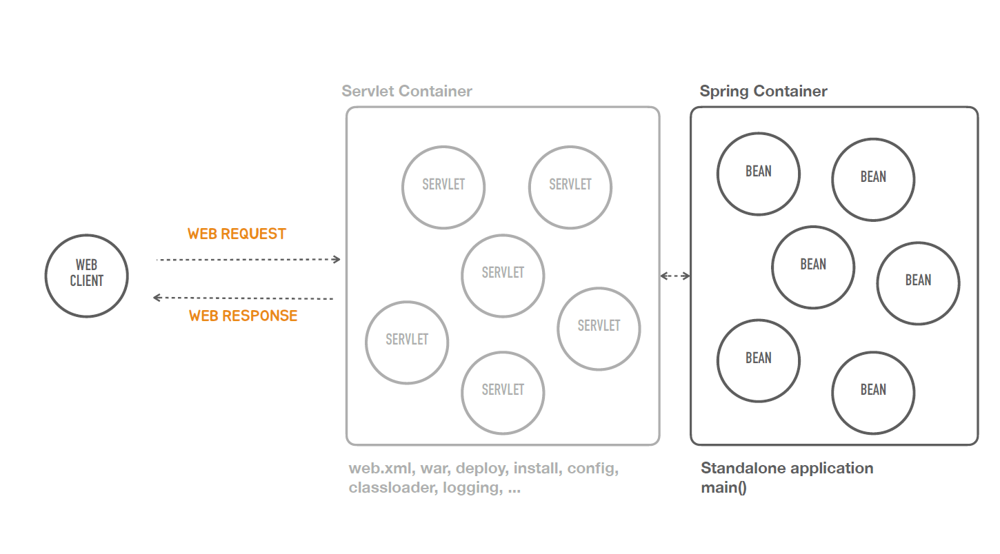

### ✅Containerless

- Containerless를 지향한다는 것은 서블릿 컨테이너와 관련된 번거롭고 복잡한 작업들 또 그걸 하기 위해서 필요한 지식을 더 이상 개발자가 신경쓰지 않고
  스프링 컨테이너에 올라가는 빈을 만드는 것에만 집중해서 애플리케이션을 개발하면 되도록 스프링 부트가 작업을 해주는 것이다.
####
- 그래서 아래와 같은 모델의 형태가 된다.
####
