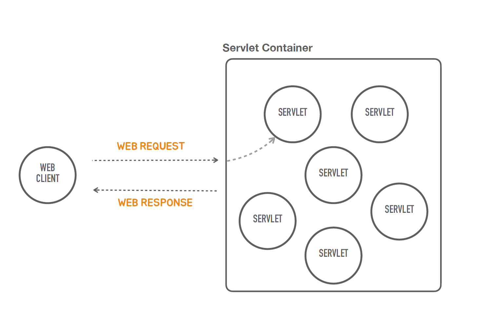
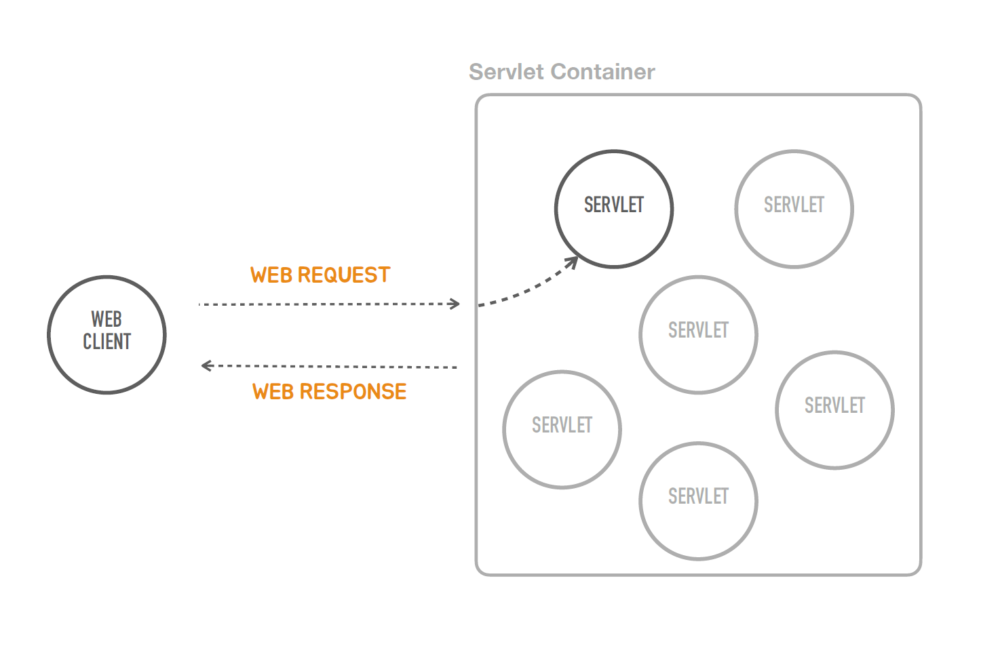
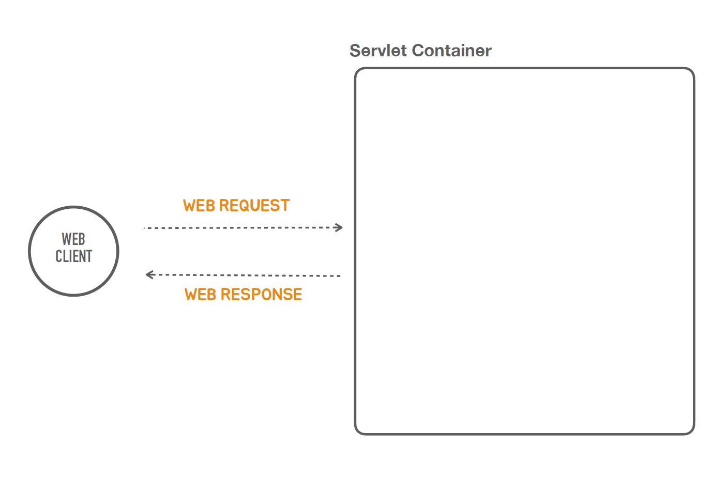

###  독립실행형 서블릿 애플리케이션


### ✅ 어떻게 이게 동작하는가? 그 원리를 하나씩 코드를 직접 만들어보자!

```java
public class TobySpringBootApplication {
    public static void main(String[] args) {
    }
}
//먼저 모든 코드를 다  지우고 직접 만들어보자
```
### ✅ 서블릿 컨테이너를 설치 하지 않고 어떻게 동작하게 만들것인가?


- 스탠드 얼론 프로그램을 만들고 그 스탠드 얼론 프로그램에서 알아서 서블릿 컨테이너를 띄워주는 작업을 해야한다.
####
- 서블릿 컨테이너에는 서블릿이 많이 있지만 관심사에서 지워야되니 먼저 서블릿 하나를 만드는 작업을 해보자
####


- 하지만 서블릿을 만들기전에 먼저 빈 서블릿 컨테이너를 만들어보자
####


#### 💡 서블릿이라는 것은 자바의 표준기술이고 이 표준 기술을 구현한 컨테이너 제품들이 많이 나와있다. (대표적 톰켓)

```java
import org.apache.catalina.startup.Tomcat;
import org.springframework.boot.web.embedded.tomcat.TomcatServletWebServerFactory;
import org.springframework.boot.web.server.WebServer;
import org.springframework.boot.web.servlet.ServletContextInitializer;

import javax.servlet.ServletContext;
import javax.servlet.ServletException;
import javax.servlet.http.HttpServlet;
import javax.servlet.http.HttpServletRequest;
import javax.servlet.http.HttpServletResponse;
import java.io.IOException;

public class TobySpringBootApplication {

    public static void main(String[] args) {
        ServletWebServerFactory serverFactory = new TomcatServletWebServerFactory();
        WebServer webServer = serverFactory.getWebServer(servletContext -> {
            servletContext.addServlet("hello", new HttpServlet() {
                @Override
                protected void service(HttpServletRequest req, HttpServletResponse resp) throws ServletException, IOException {
                    super.service(req, resp);
                }
            });
        });
        webServer.start();
    }
}
```
1. 톰캣을 먼저 띄우기
####
2. TomcatServletWebServerFactory() - 톰캣서블릿 컨테이너를 내장에서 이거를 쉽게 사용가능하게 만들어준클래스
####
3. TomcatServletWebServerFactory() 안에 getWebServer라는 서블릿 컨테이너를 생성하는 함수가 있다.
####
💡 WebServer가 리턴 타입인데 톰캣이 아닌이유는 톰캣뿐만 아니고 다른 서블릿 컨테이너를 제티 등등도 사용할수 있게 추상화를 해놨기 때문이다.
####
4. start()를 하면 tomcat 웹서버가 8080 포트에 실행이 된다.
####
5. ServletWebServerFactory의 getWebServer는 ServletContextInitializer를 파라미터로 갖는다.
####
💡 ServletContextInitializer의 역할 : 서블릿 컨텍스트를 프로그램에 의해서 구성하는 작업에 사용되어지는 인터페이스<br>
💡 간단히 말해서 이거를 이용해서 서블릿 컨테이너에다가 서블릿을 등록하는데 필요한 작업을 수행하는 그런 오브젝트를 만들때 쓴다.
####
6. ServletContextInitializer가 구현했어야될 onStartUp 메서드 만들기
```java
import org.springframework.boot.web.servlet.ServletContextInitializer;

import javax.servlet.ServletContext;
import javax.servlet.ServletException;

public class TobySpringBootApplication {

    public static void main(String[] args) {
        ServletWebServerFactory serverFactory = new TomcatServletWebServerFactory();
        WebServer webServer = serverFactory.getWebServer(new ServletContextInitializer() {
            @Override
            public void onStartup(ServletContext servletContext) throws ServletException {
                
            }
        });
        webServer.start();
    }
}
```
####
7. 함수형 인터페이스(Functional Interface)이기 떄문에 람다식으로 바꾸기 가능

 ```java
import org.springframework.boot.web.servlet.ServletContextInitializer;

import javax.servlet.ServletContext;
import javax.servlet.ServletException;

public class TobySpringBootApplication {

    public static void main(String[] args) {
        ServletWebServerFactory serverFactory = new TomcatServletWebServerFactory();
        WebServer webServer = serverFactory.getWebServer((ServletContextInitializer) 
                servletContext -> {
                   
        });
        webServer.start();
    }
}
```
####
8. ServletContext안에는 addServlet이라는 메서드가 있다 <br>
    - 오브젝트를 만들어서 사용하는 방법을 해본다.
    - 첫번째 파라미터값인 서블릿 이름 - Hello컨트롤러 만든것과 유사하게 동작하게 하는 코드를 넣을거니 "Hello"
    - 두번째 파라미터값인 서블릿타입(인터페이스)인데 그걸 구현해 놓은 일종의 어댑터 클래스가 있는데 HttpServlet이라는 클래스이다.
    - HttpServlet에서 service라는 메서드를 구현해서 사용한다.
    - service메서드를 보면 요청과 응답을 만드는 오브젝트가 파라미터로 하나씩 전달이 된다.
    - addServlet만해서 등록하면 끝나지는 않는다, 서블릿 컨테이너가 컨테이너로 들어오는 웹 요청을 어느 서블릿에 연결해줄거냐를 결정하는 매핑이 필요한데 그 매핑을 추가해줘야된다.
    - addMapping를 이용해서 해당 url로 들어오는게 service로 전달이 되고 service메서드안에서 응답을 만들어낸다.
 ```java
import org.springframework.boot.web.servlet.ServletContextInitializer;

import javax.servlet.ServletContext;
import javax.servlet.ServletException;
import javax.servlet.ServletRequest;
import javax.servlet.ServletResponse;
import javax.servlet.http.HttpServlet;
import java.io.IOException;

public class TobySpringBootApplication {

    public static void main(String[] args) {
        ServletWebServerFactory serverFactory = new TomcatServletWebServerFactory();
        WebServer webServer = serverFactory.getWebServer((ServletContextInitializer)
                servletContext -> {
                    servletContext.addServlet("hello", new HttpServlet() {
                        @Override
                        public void service(ServletRequest req, ServletResponse res) throws ServletException, IOException {
                            super.service(req, res);
                        }
                    }).addMapping("/hello");
                });
        webServer.start();
    }
}
```
####
####
9. 웹 응답을 만든다.
    - 웹 응답의 3가지 요소
        - 상태라인에서 상태코드, 헤더(컨텐츠타입) , 바디
 ```java
import org.springframework.boot.web.servlet.ServletContextInitializer;

import javax.servlet.ServletContext;
import javax.servlet.ServletException;
import javax.servlet.ServletRequest;
import javax.servlet.ServletResponse;
import javax.servlet.http.HttpServlet;
import javax.servlet.http.HttpServletRequest;
import javax.servlet.http.HttpServletResponse;
import java.io.IOException;

public class TobySpringBootApplication {

   public static void main(String[] args) {
      ServletWebServerFactory serverFactory = new TomcatServletWebServerFactory();
      WebServer webServer = serverFactory.getWebServer((ServletContextInitializer)
              servletContext -> {
                 servletContext.addServlet("hello", new HttpServlet() {
                    @Override
                    public void service(HttpServletRequest req, HttpServletResponse res) throws ServletException, IOException {
                       res.setStatus(200); //응답코드
                       res.setHeader("Content-Type", "text/plain"); //헤더
                       res.getWriter().println("Hello Servlet");//바디
                    }
                 }).addMapping("/hello");
              });
      webServer.start();
   }
}
```
####
10. Http -v :8080/hello로 요청을 보내면 잘 나온다.
