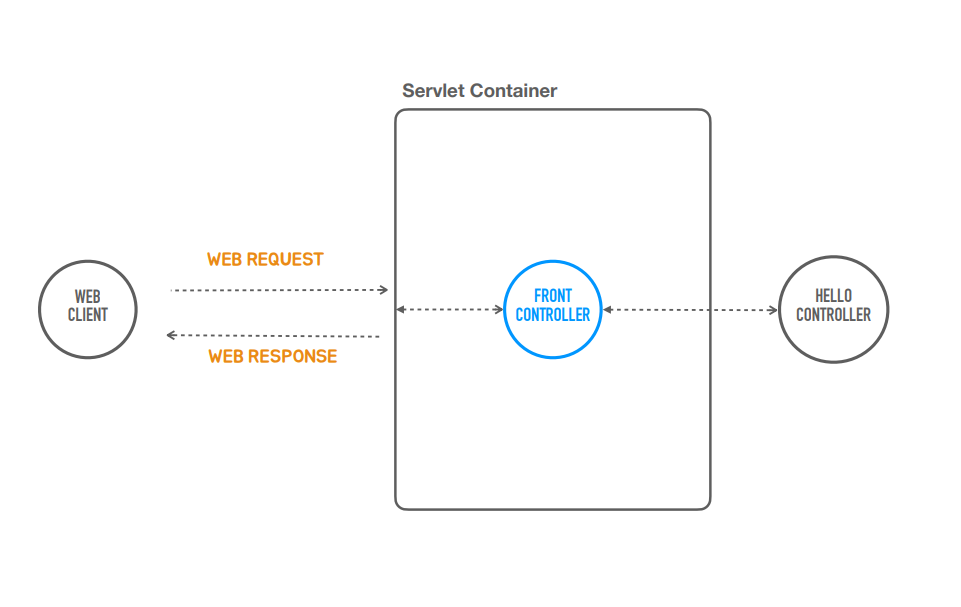
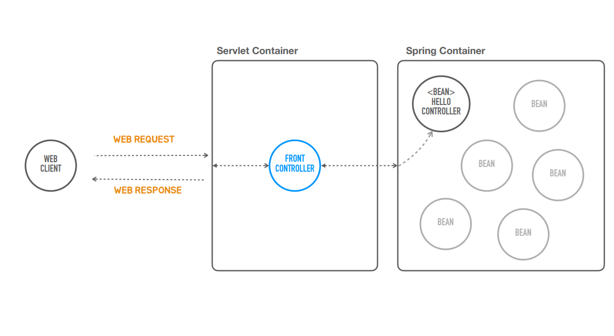

### ✅ 스프링 컨테이너 사용
- 일단 지금까지 만들었던 걸 그림으로 살펴보자

  1. 서블릿 컨테이너를 코드에서 띄웠다.
  2. 서블릿을 모든 요청을 다 받아서 뒤에있는 오브젝트한테 작업을 위임하고 필요하다면 파라미터같은 걸 바인딩해서 전달하는 프론트 컨트롤러를 만들었따.
  3. 뒤에 HelloController라는 오브젝트를 하나 만들어서 사용하는 방식으로 구성했다.

####
- 이제 HelloController라는 오브젝트를 스프링 컨테이너 안에 집어 넣어보자

    1. 이제 컨테이너가 2개다 되었다.
    2. 이제는 프론트컨트롤러가 직접 HelloController를 직접 생성하고 변수에 사용하는 대신 스프링컨테이너를 이용하는 방식으로 변경 해보자
    3. 컨테이너라는 건 여러 오브젝트를 가지고 있다가 필요할때 사용되어지도록 관리를 해주는 거다.

### ✅코드로 만들어보기

1. setHeader라는 메서드 대신 바로  res.setContentType(MediaType.TEXT_PLAIN)사용가능
####
2. 스프링 컨테이너를 만들어서 거기다가 HelloController라는 것을 집어 넣고 그 HelloController를 우리가 직접 생성대신
   - new HelloController 지우기
####
3. 스프링 컨테이너한테 가져온다음에 사용하는 방식으로 만들어야된다.
####
4. 스프링 컨테이너를 만들어보려면 먼저 스프링 컨테이너를 대표하는 인터페이스가 있다 (applicationContext)
    - applicationContext : 애플리케이션이 어떤 빈이 들어갈 것인가부터 시작해서 리소스에 접근방법 등 많은 기능을 수행하는 기능을 담고있는 오브젝트들이 구현해야되는게 스프링의 ApplicationContext인데 
    - 결국 이 applicationContext는 스프링컨테이너가 되는것이다.
    - applicationContext중에서 코드를 손쉽게 만들어 지게 할수 있는게 하나있는데 그게 GenericApplicationContext이다.
####
5. 서블릿 같은 경우는 직접 new해서 오브젝트를 만든다음에 add했는데 스프링 컨테이너는 어떤 클래스를 이용해서 빈 오브젝트를 생성할 것인가 메타 정보를 넣어주는 방식 보통 구성을 한다.
####
6. applicationContext.registerBean으로 클래스를 빈으로 등록시킨다. 
####
7. 스프링 컨테이너가 이 안에 빈이 어떻게 구성되어 지는가 어떤 클래스로 빈을 만들것인가 이런 정보를 갖게 있게 되면 진짜 빈 오브젝트를 만든다.
####
8. 처음 자기가 갖고있는 구성정보를 이용해서 컨테이너를 초기화하는 작업 applicationContext.regresh()를 이용해서 하면 ApplicationContext가 빈 오브젝트를 다만들어준다.
####
9. getBean를 이용해서 빈 오브젝트를 가져오면 이 타입이 HelloController클래스 타입이 된다(뒤에서 지정한 클래스타입)

```java

import com.example.tobyspringboot.HelloController;
import org.springframework.context.support.GenericApplicationContext;
import org.springframework.http.HttpMethod;
import org.springframework.http.HttpStatus;

import javax.servlet.http.HttpServletRequest;
import javax.servlet.http.HttpServletResponse;

public class TobySpringBootApplication {

    public static void main(String[] args) {
        GenericApplicationContext applicationContext = new GenericApplicationContext();


        applicationContext.registerBean(HelloController.class);
        applicationContext.refresh();
        
        ServletWebServerFactory serverFactory = new TomcatServletWebServerFactory();
        WebServer webServer = serverFactory.getWebServer((ServletContextInitializer)
                servletContext -> {
                    // 저 HelloController라는 것은 매 요청마다 새로운 인스턴스를 만들 필요가 없다 계속 재사용해도된다.
                    servletContext.addServlet("frontcontroller", new HttpServlet() {
                        @Override
                        public void service(HttpServletRequest req, HttpServletResponse res) throws ServletException, IOException {
                            //인증 , 보안 , 다국어, 공통 기능
                            if (req.getRequestURI().equals("/hello") && req.getMethod().equals(HttpMethod.GET.name())) {
                                String name = req.getParameter("name");
                    
                               HelloController helloController  =  applicationContext.getBean(HelloController.class);
                                String ret = helloController.hello(name);

                                res.setContentType(MediaType.TEXT_PLAIN); //헤더
                                res.getWriter().println(ret);//바디   
                            } else {
                                res.setStatus(HttpStatus.NOT_FOUND.value());
                            }
                        }
                    }).addMapping("/*");
                });
        webServer.start();
    }
}
```

