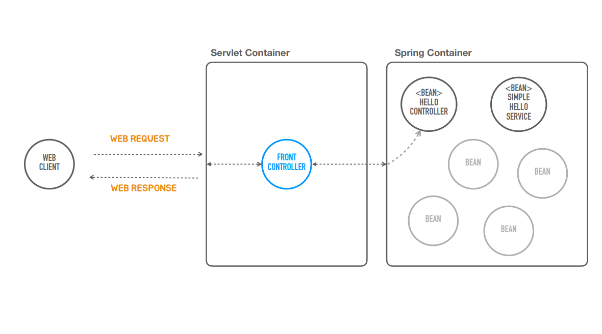

### ✅ 의존 오브젝트 추가

#### 📌 서블릿 컨테이너 쓰는 방식과 무엇이 다를까?
    - 가장 중요한것은 스프링 컨테이너가 할수 있는 일들을 계속 적용가능한 기본구조를 만들어 놓는것이다.
    - 스프링 컨테이너는 기본적으로 이안에 어떤 타입의 오브젝트를 만들 때 딱 한번만 만든다
        - 스프링 컨테이너가 가지고 있는 필요로 하는 앞에 여러 서블릿 컨테이너가 HelloController를 계속 만들어서 요청하는게 아니라 HelloController오브젝트를 계속 동일한 오브젝트를 리턴을 해준다.
        - 이렇게 애플리케이션에서 오브젝트를 딱 하나만 만들고 재사용 하는 방식을 "싱글톤 패턴"이라고한다.
###
✅ 코드로 의존 오브젝트 추가(DI)
####
 HelloController안에서 모든 요청을 다 처리하면 좋겠지만 역할에 따라서 오브젝트를 분리해서 만들고 필요할떄 요청할 수 있다.
####
 
####

1. SimpleHelloService 클래스 만들기
```java
public class SimpleHelloService {
   public String sayHello(String name){
        return "Hello" + name;
    }
}

```

2. HelloController에 의존성 추가하기 생성자 주입 방식으로 만들기

```java
import java.util.Objects;

public class HelloController {

    private final HelloService helloService;

    public HelloController(HelloService helloService) {
        this.helloService = helloService;
    }

    public String hello(String name) {
        return helloService.sayHello(Objects.requireNonNull(name));
    }
}
```

3. HelloService타입의 클래스도 빈으로 등록을 해줘야된다.
   - applicationContext.registerBean(HelloService.class)라고만 넣으면 안된다 인터페이스이기 때문이다.
   - 그래서 SimpleHelloService.class로 넣어준다.
   - SimpleHelloService도 스프링빈으로 등록해서 컨테이너가 직접 생성을 하도록 만든다.
```java

import com.example.tobyspringboot.HelloController;
import com.example.tobyspringboot.HelloService;
import com.example.tobyspringboot.SimpleHelloService;
import org.springframework.context.support.GenericApplicationContext;
import org.springframework.http.HttpMethod;
import org.springframework.http.HttpStatus;

import javax.servlet.http.HttpServletRequest;
import javax.servlet.http.HttpServletResponse;

public class TobySpringBootApplication {

    public static void main(String[] args) {
        GenericApplicationContext applicationContext = new GenericApplicationContext();


        applicationContext.registerBean(HelloController.class);
        applicationContext.registerBean(SimpleHelloService.class);
        applicationContext.refresh();

        ServletWebServerFactory serverFactory = new TomcatServletWebServerFactory();
        WebServer webServer = serverFactory.getWebServer((ServletContextInitializer)
                servletContext -> {
                    // 저 HelloController라는 것은 매 요청마다 새로운 인스턴스를 만들 필요가 없다 계속 재사용해도된다.
                    servletContext.addServlet("frontcontroller", new HttpServlet() {
                        @Override
                        public void service(HttpServletRequest req, HttpServletResponse res) throws ServletException, IOException {
                            //인증 , 보안 , 다국어, 공통 기능
                            if (req.getRequestURI().equals("/hello") && req.getMethod().equals(HttpMethod.GET.name())) {
                                String name = req.getParameter("name");

                                HelloController helloController = applicationContext.getBean(HelloController.class);
                                String ret = helloController.hello(name);

                                res.setContentType(MediaType.TEXT_PLAIN); //헤더
                                res.getWriter().println(ret);//바디   
                            } else {
                                res.setStatus(HttpStatus.NOT_FOUND.value());
                            }
                        }
                    }).addMapping("/*");
                });
        webServer.start();
    }
}
```