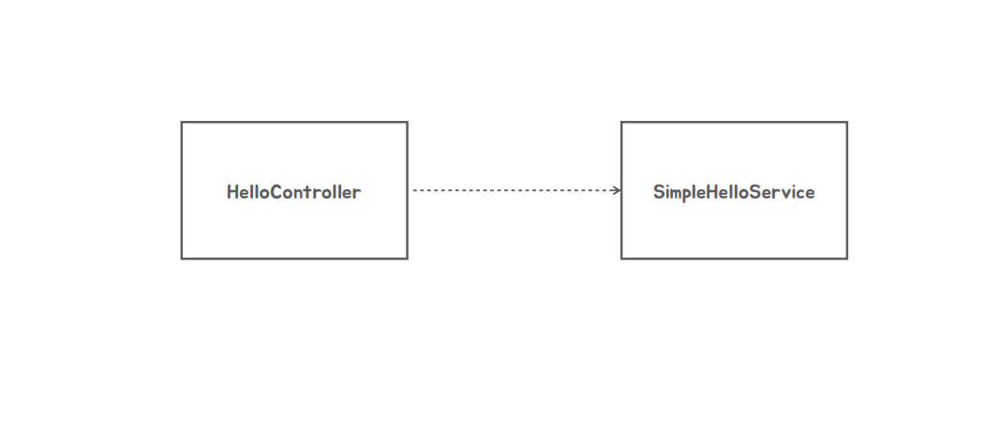
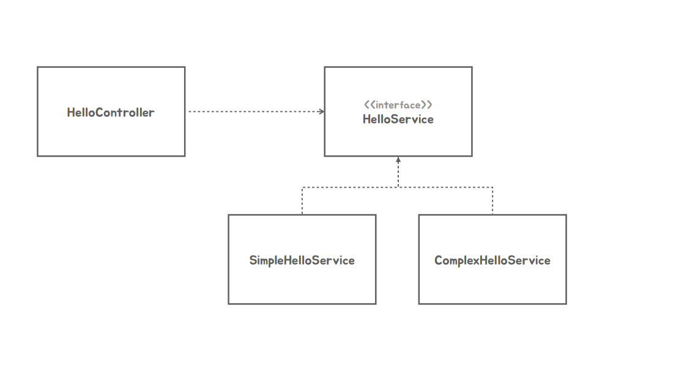
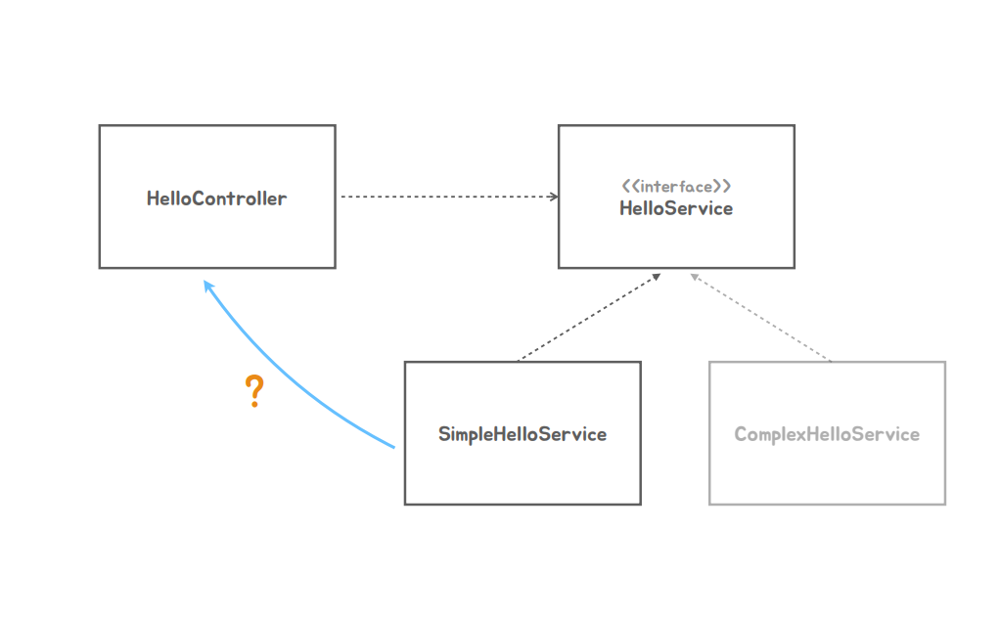

### ✅ Dependency Injection

#### 📌 의존성 주입 DI
1. 지금 HelloController와 SimpleHelloService라는 클래스 2개를 만들었는데 이 2개의 클래스의 의존관계는 이렇게 되어있다.
####

 - HelloController는 SimpleHelloService가 변경이되면 영향을 받는다.
 - 근데 이런 방식은 문제가 있는데 만약 또 다른 Service를 만들고 싶은데 이럴 경우 HelloController의 코드를 수정해야된다.
####
2. 이 문제를 해결하기 위한 것인 Interface를 만든다.
   - 이렇게 만들어두면 HelloController는 HelloService를 구현한 클래스를 아무리 많이 만들어도 HelloController의 코드를 안고쳐도된다.
  
   

3. 하지만 여기서 끝나는 게 아니다 소스코드 레벨에서는 의존하고 있지않지만 실제로 런타임이 되면 HelloController는 HelloService인터페이스를 구현한 어떠한 클래스의 오브젝트를 이용해야된다.
4. 내가 어느 클래스의 오브젝트를 사용할 것인가 결정이 되어있어야된다. 
5. 이번에는 SimpleHelloService를 이용하기로 결정했다고 가정해보자
   - 그러면 HelloController로 만든 오브젝트는 sayHello라는 메서드를 호출 할때 어느 클래스로 만든 오브젝트의 메서드를 이용하는건지 이거를 알수가 없다.
   - 그래서 어떻게든 이 HelloController와 SimpleHelloService의 연관관계를 만들어줘야되는데 이 작업을 해주는 과정을  **"Dependency Injection"** 이라고 부른다.

###
6. Dependency Injection에는 제 3의 존재가 필요하다 이거를 Assembler라고 부른다.

#### 💡 Assembler
   - HelloController는 Hello인터페이스를 구현한 어떠한 클래스에 의존을 하는데 소스 코드 레벨에서는 의존을 하고싶지 않다.
   - SimpleHelloService에서 ComplexHelloService로 바꿨다고해서 소스코드를 고치고 싶지 않다
   - 그거 누군가가 해야되는데 HelloController가 사용하는 오브젝트를 new 키워드를 사용해서 만드는 대신에 외부에서 오브젝트를 만들어서 HelloController가 사용할 수 있도록 주입을 해준다 
   - 그 작업을 해주는게 어셈블러라고하는데 이거를 우리는 Spring Container라고 부른다.

#### 💡 Spring Container의 역할
   - 우리가 메타정보를 주면 그걸 가지고 클래스에 싱글톤 오브젝트를 만드는데 그 오브젝트가 사용할 다른 오브젝트가 있다면 그 오브젝트를 주입해주는 작업까지 수행을 해주는 것