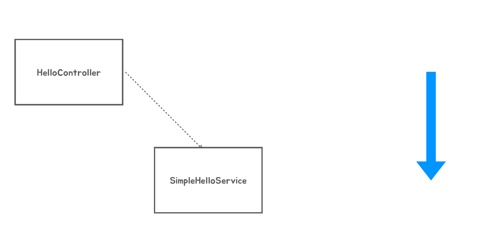
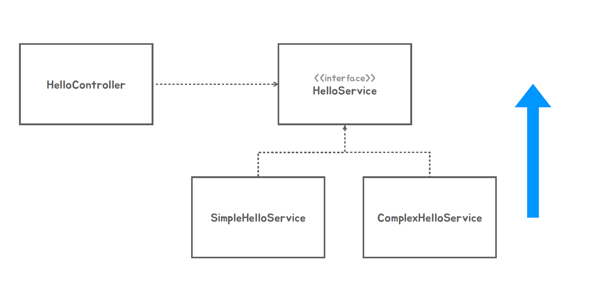
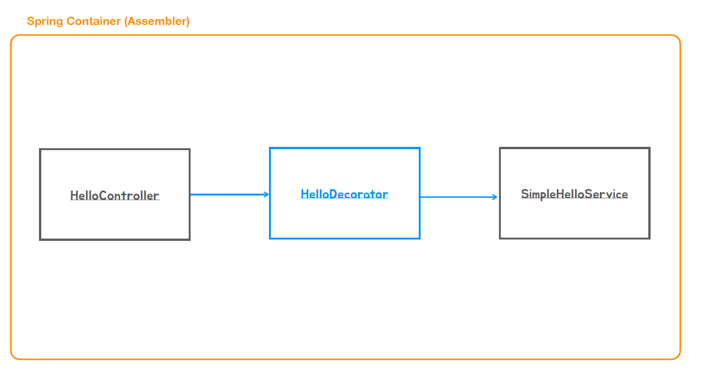
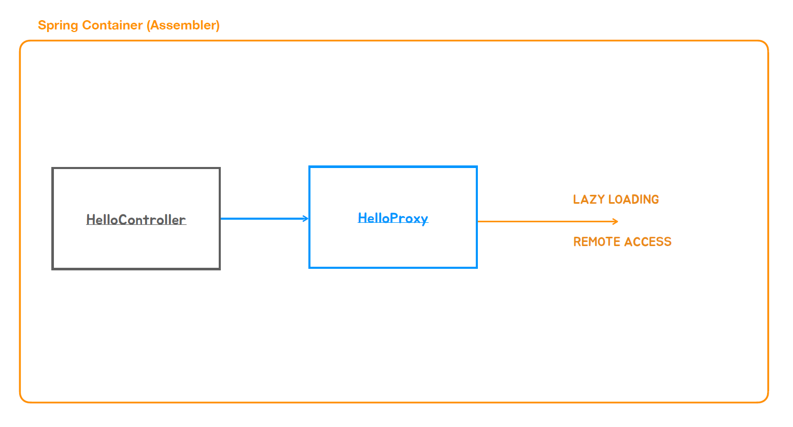

### ✅ Di를 이용한 Decorator, Proxy패턴

1. 아래 그림과 같이 HelloController가 SimpleHelloService를 직접 의존하고 있는 상태
   - 이럴 때는 new SimpleHelloService()를 만들어서 사용을 했다.
   - SimpleHelloService의 변경이 HelloController에 직접 영향을 미친다.
####

2. Di를 이야기하면서 이 구조를 아래그림과 같이 바꿨다.
   - 추상화된 HelloService만 의존하고 밑에 구현하는 클래스들이 Interface를 구현하도록 만들었다.
   - 이런 작업을 할때 필요한게 Dependency Injection이다.
   - HelloController가 밑에 클래스를 어떤것도 의존하지 않지만 런타임시 어떤걸 사용하는지 의존관계를 주입해준다.

3. 아래와같이 HelloDecorator 구조를 만든다고 생각하자 (Decorator패턴)

4. Proxy패턴

