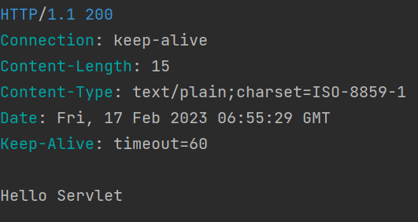

##  독립실행형 서블릿 애플리케이션

### ✅서블릿 요청 처리

#### 1. 먼저 하드코딩으로 "Content-Type" 같이 직접쓰면 오타날 위험이 있기 때문에 ENUM을 활용

 ```java
public class TobySpringBootApplication {

    public static void main(String[] args) {
        ServletWebServerFactory serverFactory = new TomcatServletWebServerFactory();
        WebServer webServer = serverFactory.getWebServer((ServletContextInitializer)
                servletContext -> {
                    servletContext.addServlet("hello", new HttpServlet() {
                        @Override
                        public void service(HttpServletRequest req, HttpServletResponse res) throws ServletException, IOException {
                            
                            
                            res.setStatus(HttpStatus.OK.value()); //응답코드
                            res.setHeader(HttpHeaders.CONTENT_TYPE, MediaType.TEXT_PLAIN); //헤더
                            res.getWriter().println("Hello Servlet");//바디
                        }
                    }).addMapping("/hello");
                });
        webServer.start();
    }
}
```
#### 2. 쿼리스트링처럼 파라미터를 넘어와서 동적인 코드를 작성해보자
#### 3. request.getParameter로 name으로 들어오면 해당 값을 String으로 받는다
#### 4. 응답이 잘들어오는지 확인

 ```java

import javax.servlet.http.HttpServletRequest;
import javax.servlet.http.HttpServletResponse;

public class TobySpringBootApplication {

    public static void main(String[] args) {
        ServletWebServerFactory serverFactory = new TomcatServletWebServerFactory();
        WebServer webServer = serverFactory.getWebServer((ServletContextInitializer)
                servletContext -> {
                    servletContext.addServlet("hello", new HttpServlet() {
                        @Override
                        public void service(HttpServletRequest req, HttpServletResponse res) throws ServletException, IOException {
                            String name = req.getParameter("name");

                            res.setStatus(HttpStatus.OK.value()); //응답코드
                            res.setHeader(HttpHeaders.CONTENT_TYPE, MediaType.TEXT_PLAIN); //헤더
                            res.getWriter().println("Hello" + name);//바디
                        }
                    }).addMapping("/hello");
                });
        webServer.start();
    }
}
```



### ✅프론트 컨트롤러
 - 서블릿은 요청마다 직접 하나씩 맵핑을 해야 한다. ex) /hello는 이걸 담당하는 서블릿을 따로 만들어서 처리를 했다
 - 하지만 초기부터 이런 서블릿의 접근 방법을 개선할 필요가 있었다.
   - 첫번째 요구사항 서블릿이 여러개가 다 늘어나고 모든 서블릿이 컨테이너로부터 요청을 직접받아서 모두 리턴하는방식으로 만들다보니 공통 코드들이 중복되어서 중복코드를 없애야 한다.
   - 두번째 요구사항 기본적인 서블릿으로 개발하기에는 한계가 있었는데 이걸 해결하기 위해 등장한게 프론트 컨트롤러다
####
### 📌 프론트 컨트롤러란?
 - 원래 서블릿은 각 URL에 맞게 매핑을 해가지고 각기 다른 서블릿이 다른 URL을 맡아서 처리하는 방식으로 처리해야 된다.
 - 하지만 프론트 컨트롤러는 모든 공통적으로 등장하는 처리하는 코드를 만들고 요청의 종류에 따라서 이 로직을 처리하는 다른 오브젝트한테 요청을 다시 전달하는 방식
 - 결국 공통적인 부분을 제일 앞단에서 처리하게 하는 것
 - 프론트 컨트롤러가 처리해주는 공통적인 작업 : 인증, 보안, 다국어처리 등

---
### ✅프론트 컨트롤러로 전환
1. "/" 밑으로 들어오는 모든 요청을 이 서블릿이 다 처리하겠다 서블릿 컨테이너에 등록
2. 서블릿 컨테이너의 매핑기능을 프론트 컨트롤러가 담당을 해야된다. 
   - 매핑은 요청을 가지고 하는 것
   - req.getRequestURI로 해당 URI에 맞는 것 처리
   - req.getMethod().equals(HttpMethod.GET.name()) 로 메서드까지 일치하게  할 수 있음
 ```java

import org.springframework.http.HttpMethod;
import org.springframework.http.HttpStatus;

import javax.servlet.http.HttpServletRequest;
import javax.servlet.http.HttpServletResponse;

public class TobySpringBootApplication {

   public static void main(String[] args) {
      ServletWebServerFactory serverFactory = new TomcatServletWebServerFactory();
      WebServer webServer = serverFactory.getWebServer((ServletContextInitializer)
              servletContext -> {
                 servletContext.addServlet("frontcontroller", new HttpServlet() {
                    @Override
                    public void service(HttpServletRequest req, HttpServletResponse res) throws ServletException, IOException {
                       //인증 , 보안 , 다국어, 공통 기능
                       if (req.getRequestURI().equals("/hello") && req.getMethod().equals(HttpMethod.GET.name())) {
                          String name = req.getParameter("name");

                          res.setStatus(HttpStatus.OK.value()); //응답코드
                          res.setHeader(HttpHeaders.CONTENT_TYPE, MediaType.TEXT_PLAIN); //헤더
                          res.getWriter().println("Hello" + name);//바디   
                       } else if (req.getRequestURI().equals("/user")) {
                          //
                       } else {
                          res.setStatus(HttpStatus.NOT_FOUND.value());
                       }
                    }
                 }).addMapping("/*");
              });
      webServer.start();
   }
}
```
---
### ✅ Hello 컨트롤러 매핑과 바인딩
