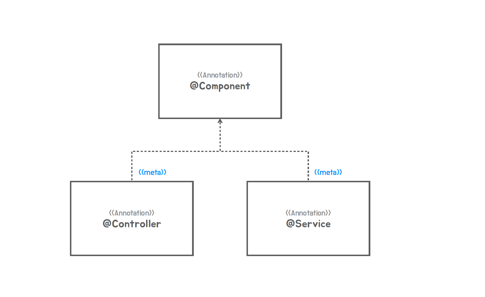
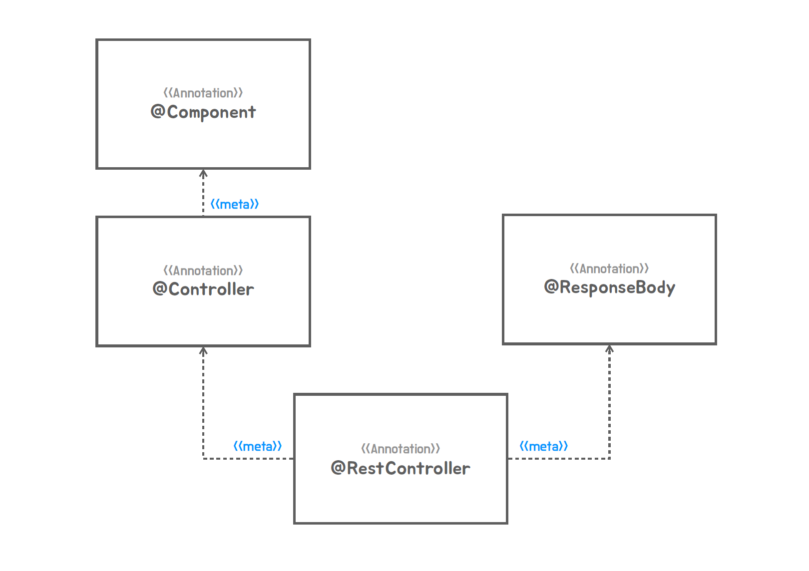

### ✅ 메타 애노테이션과 합성 애노테이션

#### 📌 자동 구성 기반 애플리케이션  @AutoConfiguration
- 스프링 부트가 애노테이션을 활용할 때 몇가지 기법을 잘 이해하고 그걸로 코드도 살펴볼 수 있어야하고 우리도 이제 그걸 응용하는 지식을 쌓아야 한다.

#### 📌 Meta Annotation
- Meta Annotation의 장점 
  - 메타 애노테이션이 적용된 것과 기능적인 면에서는 차이가 없지만 다른 이름을 부여하면 이 코드를 읽을 떄  이건 MVC의 어느 부분인지를 알 수 있다.
  - 부가적인 효과를 기대할 수 있다, 예를 들어서 Controller 애노테이션이 붙어있으면 RequestMapping이나 GetMapping을 찾고 새로운 요소를 추가할 수있다.
  - <span style="color:orange">애노테이션은 상속은 아니다.</span>




1. 애노테이션을 직접 만들 수 있다.
   - UnitTest라는 애노테이션을 만들어보자
   - UnitTest를 메타 애노테이션을 가지는 또 애노테이션도 만들 수 있다.
   - Target에 이건 애노테이션 타입에도 받게해달라고 ElementType.ANNOTATION_TYPE을 줘도된다.

```java

@Retention(RetentionPolicy.RUNTIME)
@Target(ElementType.METHOD)
@UnitTest
@interface FastUnitTest {
}


@Retention(RetentionPolicy.RUNTIME)
@Target({ElementType.ANNOTATION_TYPE,ElementType.METHOD})
@Test
@interface UnitTest {

}

public class HelloServiceTest {

    @UnitTest
    void simpleHelloService() {
        SimpleHelloService helloService = new SimpleHelloService();

        String ret = helloService.sayHello("Test");

        Assertions.assertThat(ret).isEqualTo("Hello Test");
    }
}

```

#### 📌 Composed Annotation (합성 애노테이션)
- 이것도 메타애노테이션을 활용하는건데 매타애노테이션을 하나 이상을 적용해서 만드는 경우에 이걸 합성 애노테이션이라고 부른다.
- 합성 애노테이션을 사용하면 지금 내가 클래스나 메서드에 부여하는 애노테이션이 가지고 있는 모든 메타 애노테이션들이 거기 적용되어있는 것과 동일한 효과를 낸다.
- 반복되는 애노테이션들은 묶어서 합성애노테이션으로 만들어서 사용할 수 있다.


