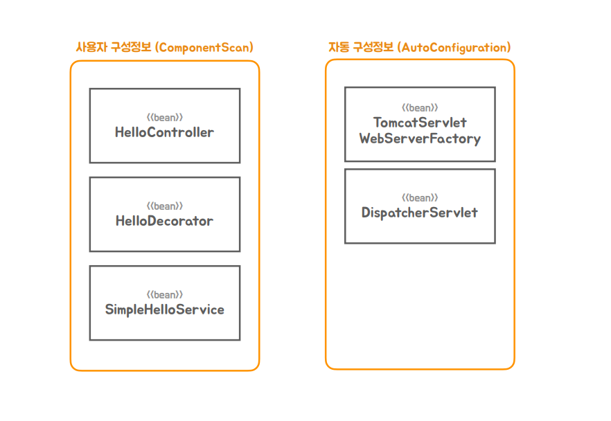
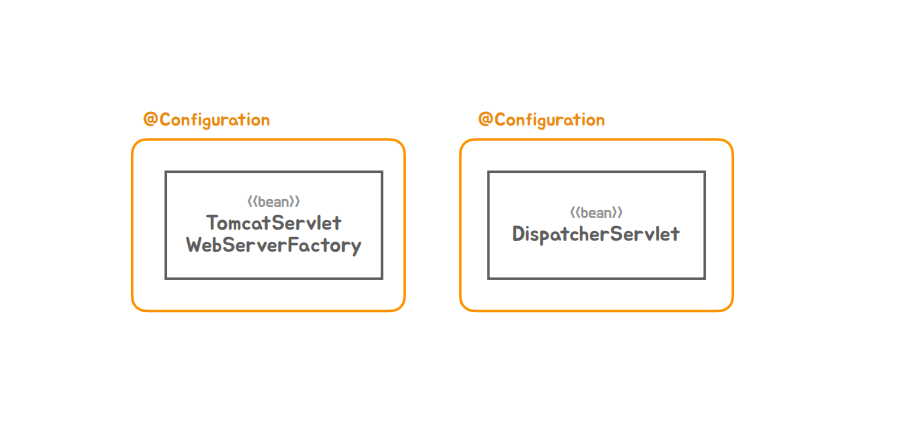

### ✅ 빈 오브젝트와 역할과 구분

#### 📌 여태까지 만들었던 빈들을 살펴보면 다음 그림과 같다.

#### 📌 TomcatServlet이나 DispatcherServlet은 스프링부트가 컨테이너 리스를 지원하기 위해 내장형 서블릿 컨테이너를 이용하는 독립 실행형 애플리케이션방식으로 동작을 하면서 요구되어진 빈들이다.

1. 스프링컨테이너에 올라가는 빈들을 구분하는 방법
    - 크게 컨테이너 인프라스트럭처 빈과 애플리케이션 빈으로 나뉘어진다.
      - 애플리케이션 빈 : 개발자가 어떤 빈을 사용하겠다고 명시적으로 구성정보를 제공한 걸 말한다.
      - 컨테이너 인프라스트럭처 빈: 스프링컨테이너 자신이거나 스프링 컨테이너가 기능을 확장하면서 추가해온 것들을 빈으로 등록시켜서 사용하는 것들을 등록시켜서 동작하게 만드는 빈
      
#### 💡 스프링컨테이너가 하는 제일 중요한 일이 빈 오브젝트를 생성하고 초기화하고 관계를 맺고 라이프 싸이클을 맺게 하는것인데, 이렇게 컨테이너가 빈을 만들고 다루는 작업중에 기능을 추가할 수있는 방법들이 있고 그걸 처리하는 처리자가 있다.

2. 애플리케이션 빈도 2가지로 나눌수 있다.
    - 애플리케이션 로직 빈 : 애플리케이션의 기능, 비즈니스 로직 등 흔히 애플리케이션을 개발할때 하는 코드들로 만들어진 빈 
    - 애플리케이션 인프라스트럭처 빈 : 기술과 관련된 것들인데 이미 만들어진거를 이것 이것을 사용하겠다고 구성정보를 작성해줘야지 나중에 애플리케이션 기능이 정상적으로 동작하는데 사용된다.

3. 그럼 우리가 만든 빈들을 어떤 구성정보인지 확인해보자
    - HelloController, HelloDecorator, SimpleHelloService는 확실히 로직빈이다.
    - 스프링부트 애플리케이션에서는 WebServerFactory와 DispatcherServlet이 두가지가 꼭 빈으로 등록이 되야된다.
    - 어떻게 보면 이 두가지는 컨테이너 인프라스트럭처 빈 같지만 우리가 명시적으로 선언을 해줘야지 빈으로 등록되고 사용이된다.

4. 스프링부트의 개발자의 분류방식으로 표현하면

5. 이 구성정보를 어떤 방식으로 만들까?
   - 사용자 구성정보는 ComponentScan을 이용해서 자바코드와 애노테이션에서 구성정보를 읽어오는 방식으로 등록
   - 자동 구성정보라는 매커니즘을 통해서 등록을 한다.
   - 사용자 구성정보는 앞에서 봐서 이해할 수 있다.
   - 그럼 AutoConfiguration이 어떤 방식으로 되는지 알아보자

#### 💡 자동 구성정보가 적용되는 방식은 다음과 같다.
   - 애플리케이션에서 사용이 될수 있는 인프라 스트럭처 빈들을 담은 Configuration 클래스들을 만들어 놓는다 (기능으로 구분을 한다)
     - 서블릿 컨터이너 생성에 필요한 팩토리 빈들을 담고있는 구성정보
     - 스프링 웹을 사용하기 위해서 필요한 디스패처 서블릿을 생성 정보
   - 스프링부트가 애플리케이션의 필요에 따라서 이중에서 필요한 Configuration들을 골라서 필요한 방식으로 구성을 해서 자동으로 구성을 해준다 ➡ 자동 구성 방식의 동작원리

