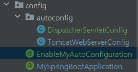
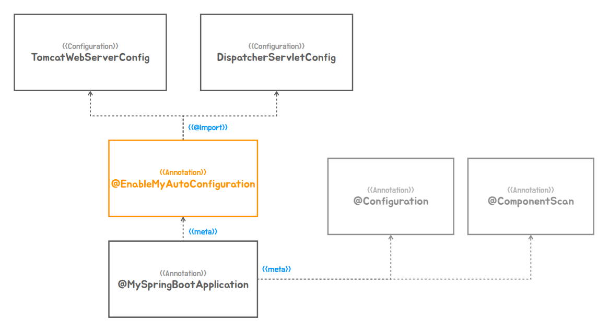

### ✅ 인프라 빈 구성 정보의 분리

#### 📌 스프링부트의 자동구성정보가 어떤 원리로 적용이 되는지 코드로 알아보자


1. 스프링부트에서 말하는 유저정보구성은 보통 ComponentScan으로 등록을 한다.
    - @MySpringBootApplication안에 메타 애노테이션으로 있기 때문에 등록이 된다.
2. Config클래스로 분리를 시켰던 WebServerFactory빈과 DispatcherServlet빈 이 두가지는 유저 구성정보에 포함 시키지 않아야된다.
    - 스프링 부트 스타일로 만들때는 이거를 애플리케이션 만드는 패키지 밑에 직접 빈으로 등록하는일을 직접 하지 않아도 자동으로 등록이 되게 만들어야한다.
    - 그래서 ConponentScan대상에 먼저 제외를 시켜보자 (패키지를 다른곳으로 옮기면 스캔 대상에서 벗어난다.)
```java
@MySpringBootApplication
public class TobySpringBootApplication {

    public static void main(String[] args) {
        SpringApplication.run(TobySpringBootApplication.class, args);
    }
}
```

3. config라는 패키지를 새로만들고 기존 페키지에서 Config 클래스를 옮기면 Component대상이 아니게 된다.
   - 이렇게 되면 ComponentScan대상은 아니게 되지만 구성정보 대상으로 만들지 못해서 실행이 안된다.
   - 구성정보 포함이 되도록 만들기 위해서는 어떻게 등록을 할까
   - 먼저 모든 애플리케이션의 시작점은 @MySpringBootApplication 애노테이션에서 시작을 한다.
   - @Import 애노테이션으로 컴포넌트 애노테이션을 붙은 클래스들을 지정을 해주면 구성정보에 직접 추가할수 있다.ㅏ
```java
@Retention(RetentionPolicy.RUNTIME)
//TYPE은 인터페이스 클래스 이넘 3개 종류의 대상이 TYPE이라고 주면된다.
@Target(ElementType.TYPE)
@Configuration
@ComponentScan
@Import(Config.class)
public @interface MySpringBootApplication {
}
```

4. 해당 빈들을 클래스를 분리해서 만들고 @Import도 각각 해주자
    - @Import({DispatcherServletConfig.class, TomcatWebServerConfig.class})
```java
@Configuration
public class DispatcherServletConfig {
    @Bean
    public DispatcherServlet dispatcherServlet(){
        return new DispatcherServlet();
    }
}
@Configuration
public class TomcatWebServerConfig {
    @Bean
    public ServletWebServerFactory servletWebServerFactory() {
        return new TomcatServletWebServerFactory();
    }
}
```

5. 이렇게 만든 클래스들은 나중에 자동 구성의 대상으로 삼을 것이다.
6. EnableMyAutoConfiguration 애노테이션을 만들어서 @Import를 따로빼준다



```java
@Retention(RetentionPolicy.RUNTIME)
//TYPE은 인터페이스 클래스 이넘 3개 종류의 대상이 TYPE이라고 주면된다.
@Target(ElementType.TYPE)
@Import({DispatcherServletConfig.class, TomcatWebServerConfig.class})
public @interface EnableMyAutoConfiguration {
}

```

#### 💡 여태까지의 구조를 그림으로 살펴보자

