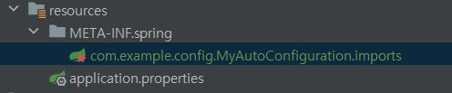

### ✅ 동적인 자동 구성 정보 등록

#### 📌 @EnableMyAutoConfiguration은 단지 @Import하드코딩되어있는 것 뿐인데 이걸 동적으로 바꿔보자

#### 💡 동적으로 가져올려면 @ImportSelector라는 애노테이션을 사용해야된다.

1. MyAutoConfigImportSelector클래스를 만들고 ImportSelector 구현하는 DeferredImportSelector를 이용해서 구현한다.
    - 이걸 @Import(MyAutoConfigImportSelector.class)로 등록한다.
```java
public class MyAutoConfigImportSelector implements DeferredImportSelector {
    @Override
    public String[] selectImports(AnnotationMetadata importingClassMetadata) {
        return new String[]{
                "com.example.config.autoconfig.DispatcherServletConfig",
                "com.example.config.autoconfig.TomcatWebServerConfig"
        };
    }
}
```

#### 💡 문자열로 Configuration 클래스 정보를 리턴 해주면 이걸 컨테이너가 로딩하는 방식이다.

2. 이 부분을 좀더 유연하게 설정하기 위해서 소스코드를 등록해놨던 정보를 외부 설정 파일로 빼보자

META-INF.spring 파일을 만들고 해당 경로를 넣어준다.


3. MyAutoConfigImportSelector를 다음과 같이 수정한다.
```java
public class MyAutoConfigImportSelector implements DeferredImportSelector {

    private final ClassLoader classLoader;

    public MyAutoConfigImportSelector(ClassLoader classLoader) {
        this.classLoader = classLoader;
    }

    @Override
    public String[] selectImports(AnnotationMetadata importingClassMetadata) {

        List<String> autoConfigs = new ArrayList<>();

        //그럼 이 방식에서 어떻게 파일 정보를 읽어올까?
        // load라는 스프링부트가 제공하는 메서드를 봐야되는데
        //META-INF.spring밑에 해당파일을 넣어준다
        for(String candidate : ImportCandidates.load(MyAutoConfiguration.class, classLoader)){
            autoConfigs.add(candidate);
        }


        //리스트에 집어넣은걸 다시 Array로 바꾸는 작업
//        return autoConfigs.toArray(new String[0]);
       //자바8이후에 array로 바꾸는 작업
        return autoConfigs.stream().toArray(String[]::new);


//        return StreamSupport.stream(candidates.spliterator(), false).toArray(String[]::new);

    }
}
```
