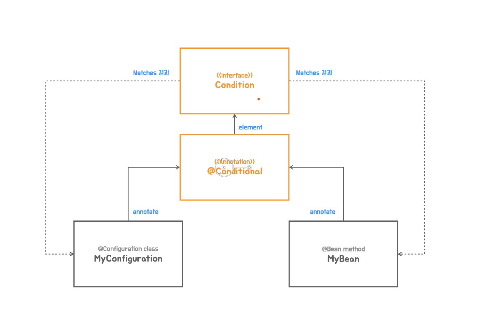

## ✅ @Conditional과 Condition

### 


1. Jetty서버도 사용가능하게 Starter도 추가하고 Configuration클래스를 만들어서 Jetty를 사용하는 빈이 만들어지도록 등록을한다.
```java
import com.example.config.MyAutoConfiguration;
import org.springframework.boot.web.embedded.jetty.JettyServletWebServerFactory;
import org.springframework.boot.web.servlet.server.ServletWebServerFactory;
import org.springframework.context.annotation.Bean;


@MyAutoConfiguration
public class JettyWebServerConfig {
   @Bean("jettyWebServerFactory")
   public ServletWebServerFactory servletWebServerFactory() {
      return new JettyServletWebServerFactory();
   }
}
```

2. 이 구성들은 자동구성방식에 의해서 AutoConfiguration의 Import라는 파일에다가 다 기술해 넣었다.
   - 하지만 무엇을 사용할때 마다 수정할 수는 없다.
   - 빈으로 등록할 Configuration클래스에 후보로 지정을 해두고 어떤 조건을 달아서 그 중에서 어떤 구성정보를 활용을 하겠다 결정을 내리게 만들어야한다.
---
### 💡 Condition
   - @Conditional에 지정되어서 구체적인 매칭 조건을 가진 클래스가 구현해야할 인터페이스이다.
   - 스프링 부트가 제공하는 ApplicationContextRunner를 사용하면 스프링 컨테이너에 빈이 등록됐는지를 테스트 할 때 편리
     하다. @Conditional이 적용된 자동 구성 클래스의 적용 여부를 테스트 할 때 사용한다.
   - Condition의 matches 메소드에는 @Conditional 애노테이션의 엘리먼트 정보를 가져올 수 있는
     AnnotatedTypeMetadata를 전달 받는다.
---

Jetty설정
```java
import org.springframework.boot.web.embedded.jetty.JettyWebServer;
import org.springframework.context.annotation.ConditionContext;
import org.springframework.core.type.AnnotatedTypeMetadata;

import java.util.concurrent.locks.Condition;

@MyAutoConfiguration
@Conditional(JettyWebServer.JettyCondition.class)
public class JettyWebServerConfig {
   @Bean("jettyWebServerFactory")
   public ServletWebServerFactory servletWebServerFactory() {
      return new JettyServletWebServerFactory();
   }

   static class JettyCondition implements Condition {
      @Override
      public boolean matches(ConditionContext context, AnnotatedTypeMetadata metadata) {
         return true;
      }
   }

}
```

Tomcat설정

```java
import com.example.config.autoconfig.TomcatWebServerConfig;

@MyAutoConfiguration
@Conditional(TomcatWebServerConfig.TomcatCondition.class)
public class JettyWebServerConfig {
   @Bean("jettyWebServerFactory")
   public ServletWebServerFactory servletWebServerFactory() {
      return new JettyServletWebServerFactory();
   }

   static class TomcatCondition implements Condition {
      @Override
      public boolean matches(ConditionContext context, AnnotatedTypeMetadata metadata) {
         return true;
      }
   }

}
```
---
#### 📌  @Conditional은 @Configuration 클래스와 @Bean 메소드에 적용 가능하다. 클래스 조건을 만족하지 못하는 경우 메소드는 무시된다.

