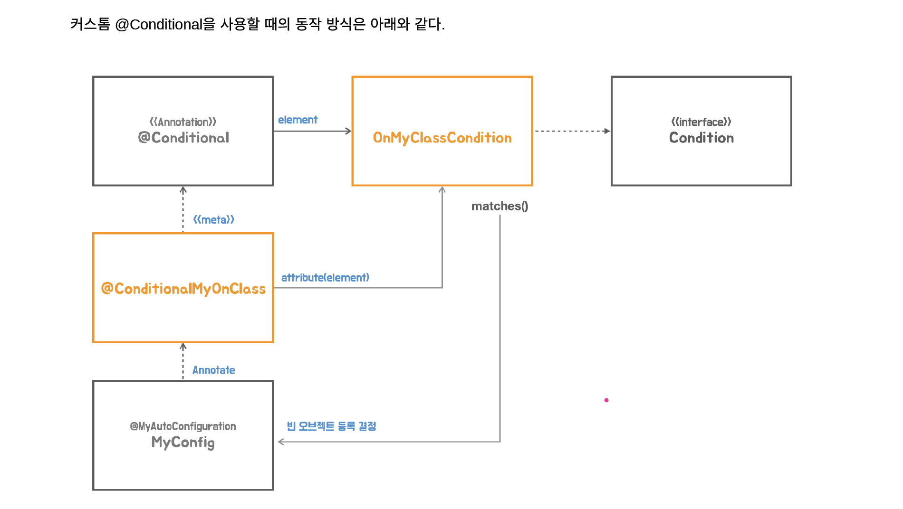

## ✅ @커스톰 @Conditional

### 💡 무엇을 기준으로 Tomcat과 Jetty을 띄울까? 
 - 스프링부트가 자동구성에서 가장 대표적으로 쓰이는 방법은 어떤 라이브러리가 이프로젝트에 포함되어있는가 체크해본다.
 - 어떤 클래스가 (Tomcat Class, Server(Jetty의 이름) Class) 있는지 찾아서 그것을 기준으로 서버를 띄우면된다.
 - 어떤 클래스가 이 프로젝트에 포함되어져있는가? 찾아보자




### 📌 ClassUtiles.isPresent() 이런 이름의 클래스가 존재하는가 알아보는 메서드 
 - 톰캣이라는 클래스가 현재 프로젝트에 포함이 되어져있으면 true리턴 빈 오브젝트로 등록되어서 사용되게하는것이다.
```java
import com.example.config.autoconfig.TomcatWebServerConfig;
import com.fasterxml.jackson.databind.util.ClassUtil;
import org.springframework.util.ClassUtils;

@MyAutoConfiguration
@Conditional(TomcatWebServerConfig.TomcatCondition.class)
public class JettyWebServerConfig {
    @Bean("jettyWebServerFactory")
    public ServletWebServerFactory servletWebServerFactory() {
        return new JettyServletWebServerFactory();
    }

    static class TomcatCondition implements Condition {
        @Override
        public boolean matches(ConditionContext context, AnnotatedTypeMetadata metadata) {
            return ClassUtils.isPresent("org.apache.catalina.startup.Tomcat", context.getClassLoader());
        }
    }

}
```

### 📌 마찬가지로 Jetty서버에도 추가
 - 실행을 해보면 Multiple라이브러리라는 에러가 발생한다, 둘다 등록이 되어져있으므로 해당 오류가 발생
 - dependencies에 해당 라이브러리를 주석처리하거나하면 된다.


### 💡 근데 Jetty와 Tomcat구성하는게 너무 비슷해서 리팩토링이 필요하다
 - 그 한개의 방법중 메타애노테이션을 만드는것이다.
 - 그게 커스톰 @Conditional인데 만들어보자

1. 커스텀 애노테이션을 만드는 주요 이유 :  컨티션에서 읽어갈수있는 Elements값을 주기위해서이다.

```java
import org.springframework.context.annotation.ConditionContext;
import org.springframework.core.type.AnnotatedTypeMetadata;
import org.springframework.util.ClassUtils;

import java.lang.annotation.ElementType;
import java.lang.annotation.Retention;
import java.lang.annotation.RetentionPolicy;
import java.lang.annotation.Target;
import java.util.Objects;
import java.util.concurrent.locks.Condition;

@Retention(RetentionPolicy.RUNTIME)
@Target({ElementType.TYPE, ElementType.METHOD})
@Conditional(MyOnClassCondition.class)
public @interface ConditionalMyOnClass {
    String value();
}


public class MyOnClassCondition implements Condition {
    public boolean matches(ConditionContext context, AnnotatedTypeMetadata metadata) {
        Map<String, Objects> attrs = metadata.getAnnotationAttributes(ConditionalMyOnClass.class.getName());
        String value = (String) attrs.get("value");
        return ClassUtils.isPresent(value, context.getClassLoader());
    }
}
```

2. 이렇게 애노테이션을 만들게되면 공통적으로 만들어놓게되어서 추상화를 해놓는게 좋다
 - 다음과 같이 코드가 바뀌게 된다.
```java
@MyAutoConfiguration
@Conditional("org.apache.catalina.startup.Tomcat")
public class JettyWebServerConfig {
    @Bean("jettyWebServerFactory")
    public ServletWebServerFactory servletWebServerFactory() {
        return new JettyServletWebServerFactory();
    }


}
```


