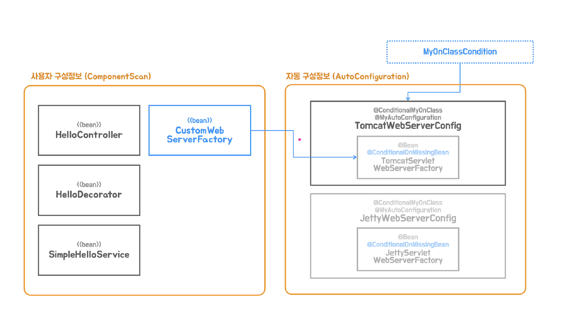

## ✅ 자동 구성 정보 대체하기

### 💡 스프링 부트의 구성정보를 작성하는 방벙은 크게 2가지다.

애플리케이션의 로직을 담당하는 부분 - 사용자 구성정보 (ComponentScan)

기술과 관련된 부분 - 스프링부트의 자동 구성정보(AutoConfiguration)



- MyAutoConfiguration.imports라는 빈정보로 등록할 Configuration 후보가 들어있다, 이 파일의 모든 정보를 읽어오고 후보로 등록한다.
- 각 Config클래스에 @Conditional 애노테이션을 보고 빈을 등록할 것인가 말것인가를 결정한다.
- ConditionalMyOnClass에서는 MyOnClassCondition클래스를 이용해서 지정한 클래스가 존재하는지 체크하고 체크하면 지금 현재구조에서는 톰캣만 있기때문에 TomcatWebServerConfig 팩토리 빈메서드가 실행이 되고 사용자 정보 구성정보로 등록한 빈들이 스플링 컨테이너 위에서 애플리케이션에서 동작하도록 한다.
- @Conditional의 조건은 개발자가 프로젝트를 어떻게 구성하는지, 어떤 라이브러리가 포함되도록 하는지에 따라서 대부분
  결정된다.

### 👀 하지만, 다른 방법이 하나더 있다.!

- 사용자 구성정보에다가 자동구성정보에 등록되는 것과 같은 기술과 관련된 인프러스트럭처빈을 직접 정의하면된다.
- 이걸 만들면 기존에 자동구성정보 후보였던 톰캣 서블릿 웹 팩토리를 우리가 등록한 빈메서드에 의해서 만들어지는 서블릿 컨테이너가 만들어질수있다.

### 이 원리를 알아보자! 우리가 직접 구성 정보를 생성하는 방법을 알아보자


1. 유저 구성정보쪽에 이렇게 직접 만들수도있다.
```java
import org.springframework.boot.web.embedded.tomcat.TomcatServletWebServerFactory;
import org.springframework.boot.web.servlet.server.ServletWebServerFactory;
import org.springframework.context.annotation.Bean;
import org.springframework.context.annotation.Configuration;

@Configuration(proxyBeanMethods = false)
public class WebServerConfiguration {
    @Bean
    ServletWebServerFactory customerWebServerFactory() {
        TomcatServletWebServerFactory serverFactory = new TomcatServletWebServerFactory();
        serverFactory.setPort(9090);
        return serverFactory;
    }
}
```

2. 그렇지만 이렇게하면 자동구성정보에 적용했던 ServletWebServerFactory와 중복되기 때문에 오류가 난다.( 해결법은 다음과 같다)
 - 자동 구성 클래스의 @Bean 메소드에 @ConditionalOnMissingBean이 있는 경우엔 유저 구성에 지정한 타입의 빈이 정
   의되어있으면 자동 구성 빈의 조건이 충족되지 않아 등록되지 않는다.

```java

import org.springframework.boot.autoconfigure.condition.ConditionalOnMissingBean;
import org.springframework.boot.web.embedded.tomcat.TomcatServletWebServerFactory;
import org.springframework.boot.web.servlet.server.ServletWebServerFactory;

public class TomcatWebServerConfig {
    @Bean("tomcatWebServerFactory")
    @ConditionalOnMissingBean
    public ServletWebServerFactory servletWebServerFactory() {
        return new TomcatServletWebServerFactory();
    }
}
```
