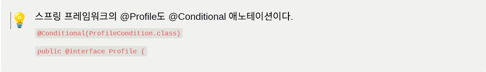
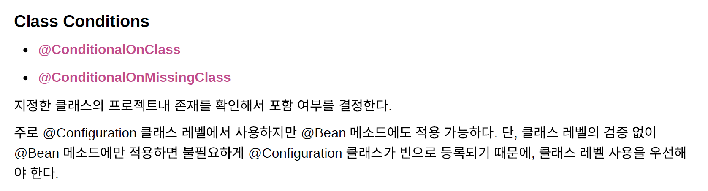
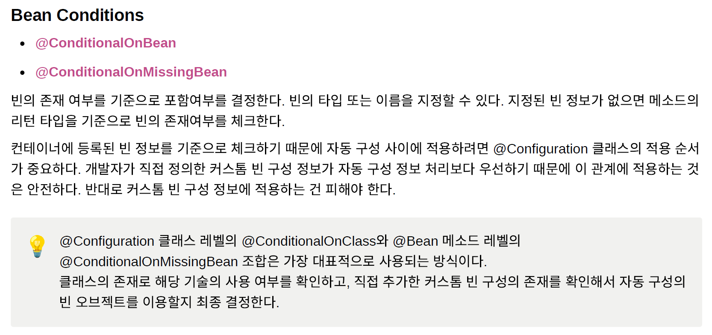
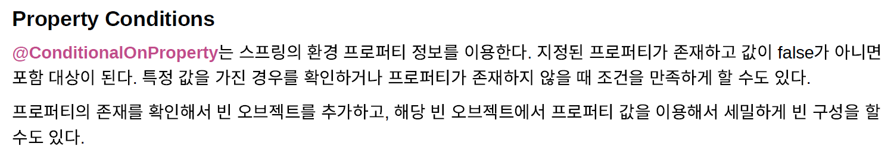
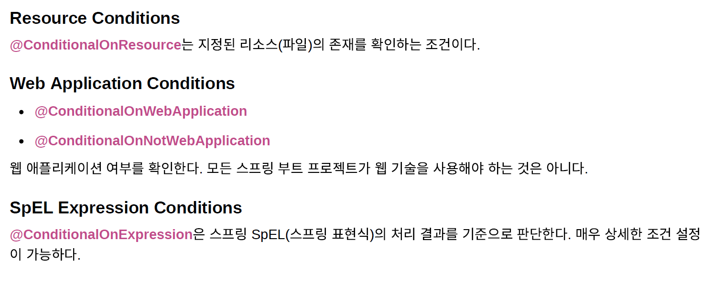

## ✅ 스프링 부트의 @Conditional

### 💡 Conditional이라는것은 스프링 프레임 워크에 들어있는 것이다.

### 📌 스프링 부트는 다음과 같은 종류의 @Conditional 애노테이션과 @Condition을 제공한다. 스프링부트의  자동 구성은 이 @Conditional을 이용한다.

#### 🔍 ConditionalOnClass 클래스의 풀네임을 지정하면 이게 프로젝트 클래스 패스에 포함되어 있는지 라이브러리로 등록했는지 이걸 확인해 보고 존재하면은 Configuration클래스나 이 메서드를 사용한다

#### 🔍 Bean Conditions 이 빈이 존재여부를 체크

#### 🔍 Property Conditions

#### 🔍 기타 Conditions

### 📌 자동 구성 정보를 등록할려면 Conditional을 이용해서 조건을 지정하는 방법도 어렵지 않게 가능한데 그 방법을 알기 위해서는 이런 종류들을 알고있어야된다.
