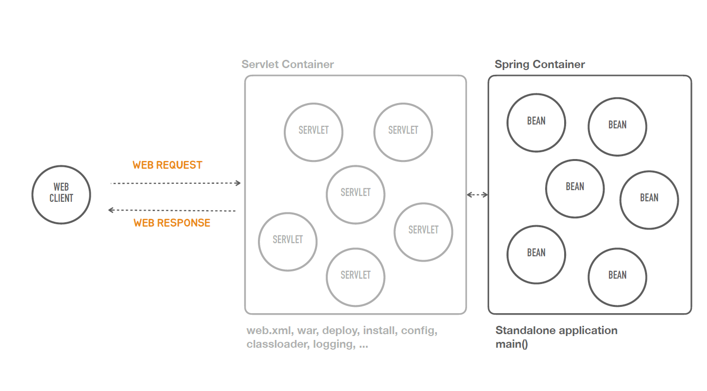
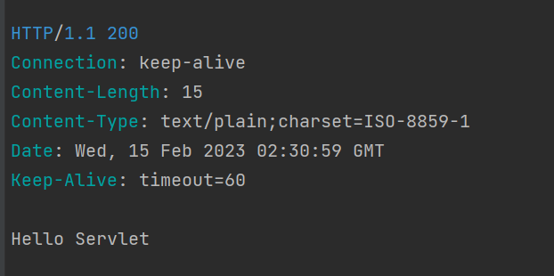

###  독립실행형 서블릿 애플리케이션

### ✅Containerless


- Containerless를 지향한다는 것은 서블릿 컨테이너와 관련된 번거롭고 복잡한 작업들 또 그걸 하기 위해서 필요한 지식을 더 이상 개발자가 신경쓰지 않고
 스프링 컨테이너에 올라가는 빈을 만드는 것에만 집중해서 애플리케이션을 개발하면 되도록 스프링 부트가 작업을 해주는 것이다.

- 그래서 아래와 같은 모델의 형태가 된다.


### ✅ 스프링 부트의 동작

```java
import org.springframework.boot.autoconfigure.SpringBootApplication;

```

- 매우 빠르게 광범위한 영역의 스프링 개발 경험을 제공
- 강한 주장을 가지고 즉시 적용 가능한 기술 조합을 제공하면서, 필요에 따라 원하는 방식으로 손쉽게 변형 가능
- 프로젝트에서 필요로 하는 다양한 비기능적인 기술(내장형 서버, 보안, 메트릭, 상태 체크, 외부 설정 방식 등) 제공
- 코드 생성이나 XML 설정을 필요로 하지 않음

### ✅ 스프링 부트의 역사

- 2012년 스프링 프레임워크 프로젝트에 이슈로 등록된 "Containerless 웹 개발 아키텍처의 지원" 요청에서 논의와 개발 시작
- https://github.com/spring-projects/spring-framework/issues/14521
---
### ✅ Containerless란?

- Serverless라고 불리는 것과 유사하다.
####
  💡Serverless란? <br>
-  서버에 대한 설치 관리 개발자가 신경 안쓰고 서버 애플리케이션을 개발해서 배포하고 운영하는게 가능하도록 하는것

####  “컨테이너 없는” 웹 애플리케이션 아키텍처란?



- Spring Container는 서블릿 컨테이너 뒷쪽에 존재해서 서블릿을 통해서 요청을 받아서 스프링이 빈을 호출한다.
- 스프링 애플리케이션 개발에 요구되는 서블릿 컨테이너의 설치, WAR 폴더 구조, web.xml,
  WAR 빌드, 컨테이너로 배치, 포트 설정, 클래스로더, 로깅 등과 같은 필요하지만 애플리케
  이션 개발의 핵심이 아닌 단순 반복 작업을 제거해주는 개발 도구와 아키텍처 지원한다
  설치된 컨테이너로 배포하지 않고 독립실행형(standalone) 자바 애플리케이션으로 동작
