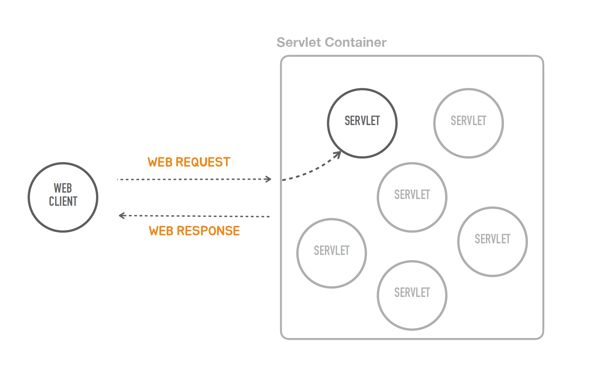
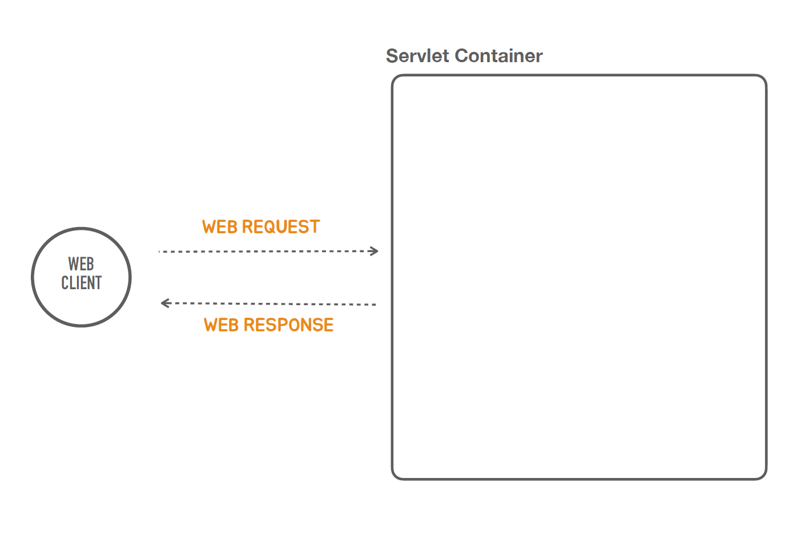

###  독립실행형 서블릿 애플리케이션

### ✅Containerless


- Containerless를 지향한다는 것은 서블릿 컨테이너와 관련된 번거롭고 복잡한 작업들 또 그걸 하기 위해서 필요한 지식을 더 이상 개발자가 신경쓰지 않고
 스프링 컨테이너에 올라가는 빈을 만드는 것에만 집중해서 애플리케이션을 개발하면 되도록 스프링 부트가 작업을 해주는 것이다.
####
- 그래서 아래와 같은 모델의 형태가 된다.
####

---

### ✅ 스프링 부트의 동작

```java

@SpringBootApplication
public class TobySpringBootApplication {

    public static void main(String[] args) {
        SpringApplication.run(TobySpringBootApplication.class, args);
    }

}


@RestController
public class HelloController {
    @GetMapping("/hello")
    public String hello(String name){
        return "Hello " + name;
    }
}


```
- 이 작업을 하기 위해서 톰캣을 설치하고 빌드를 위해서 여러가지 설정을 하지 않았다.
####
- 이 메인 메서드를 실행만 했는데 톰켓이 떠서 동작을 한다.<br>
  💡 톰캣은 자바의 대표적인 서블릿 컨테이너이다.
####
- 스프링과 관련된 어떠한 설정도 하지 않았는데 스프링 컨테이너도 동작을한다.
####
- 컨트롤러를 만들어 놓은 코드가 스프링 위에 올라갔기 때문에 컨트롤러가 동작을 하는거다.
####
#### 📌 이 모든 작업들이 SpringApplication.run 코드 한줄로 실행이 된다.


### ✅ 어떻게 이게 동작하는가? 그 원리를 하나씩 코드를 직접 만들어보자!

```java
public class TobySpringBootApplication {
    public static void main(String[] args) {
    }
}
//먼저 모든 코드를 다  지우고 직접 만들어보자
```
### ✅ 서블릿 컨테이너를 설치 하지 않고 어떻게 동작하게 만들것인가?


- 스탠드 얼론 프로그램을 만들고 그 스탠드 얼론 프로그램에서 알아서 서블릿 컨테이너를 띄워주는 작업을 해야한다.
####
- 서블릿 컨테이너에는 서블릿이 많이 있지만 관심사에서 지워야되니 먼저 서블릿 하나를 만드는 작업을 해보자
####


- 하지만 서블릿을 만들기전에 먼저 빈 서블릿 컨테이너를 만들어보자
####


#### 💡 서블릿이라는 것은 자바의 표준기술이고 이 표준 기술을 구현한 컨테이너 제품들이 많이 나와있다. (대표적 톰켓)

```java
import org.apache.catalina.startup.Tomcat;
import org.springframework.boot.web.embedded.tomcat.TomcatServletWebServerFactory;
import org.springframework.boot.web.server.WebServer;

public class TobySpringBootApplication {

    public static void main(String[] args) {
        ServletWebServerFactory serverFactory = new TomcatServletWebServerFactory();
        WebServer webServer = serverFactory.getWebServer();
        webServer.start();
    }
}
```
1. 톰캣을 먼저 띄우기
####
2. TomcatServletWebServerFactory() - 톰캣서블릿 컨테이너를 내장에서 이거를 쉽게 사용가능하게 만들어준클래스
####
3. TomcatServletWebServerFactory() 안에 getWebServer라는 서블릿 컨테이너를 생성하는 함수가 있다.
####
   💡 WebServer가 리턴 타입인데 톰캣이 아닌이유는 톰캣뿐만 아니고 다른 서블릿 컨테이너를 제티 등등도 사용할수 있게 추상화를 해놨기 때문이다.
####
4. start()를 하면 tomcat 웹서버가 8080 포트에 실행이 된다.


### ✅ 서블릿 컨테이너를 설치 하지 않고 어떻게 동작하게 만들것인가?